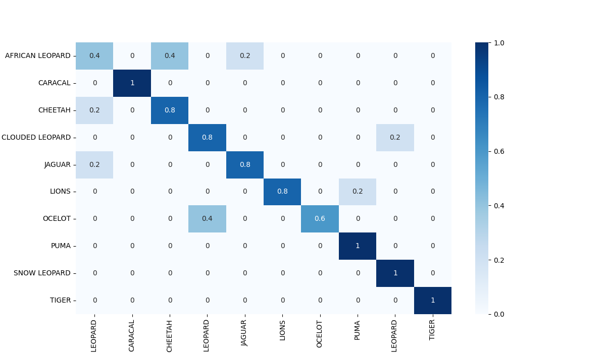

# Wild Cat Classification(Efficientnet, Inception, TinyVGG)

**Try The webapp here** [`Webapp cat Classiifer`](https://wild-cat-classifier-harikris.streamlit.app/)

This GitHub repository contains a project on Wild Cat Classification using well-established neural networks such as EfficientNet, Inception, and TinyVGG. The project involves training a deep learning model on custom datasets and using pre-trained weights on the ImageNet dataset for improved performance.

## Overview

This project aims to classify images of wild cats using state-of-the-art neural networks. The dataset used in this project contains images of various wild cat species such as tigers, lions, leopards, and cheetahs. The deep learning models were trained on this dataset, which consists of 2500 images, and tested on a separate validation set of 50 images.

Link to the dataset: [`Kaggle`](https://www.kaggle.com/datasets/gpiosenka/cats-in-the-wild-image-classification)

## Models

Three well-established neural networks were used in this project:

- **EfficientNet**: EfficientNet is a family of convolutional neural networks (CNNs) that were designed to achieve state-of-the-art accuracy with significantly fewer parameters and FLOPS than previous models. We used EfficientNet-B0 for this project.

- **Inception**: Inception is a family of CNNs that were designed to achieve good performance on various computer vision tasks. We used the Inception-v3 model for this project.

- **TinyVGG**: TinyVGG is a small variant of the VGG network architecture that was designed to achieve good accuracy with a smaller number of parameters. We used a custom implementation of the TinyVGG model for this project.

## Training

The models were trained on a custom dataset of wild cat images. The dataset was split into training and validation sets.

We used transfer learning to leverage the pre-trained weights of the models on the ImageNet dataset. The last few layers of the models were fine-tuned on the wild cat dataset to adapt the models to the specific classification task.

## Evaluation

The models were evaluated on the validation set using accuracy and F1 score metrics. The results showed that the EfficientNet model achieved the highest accuracy of 96% on Test dataset, followed by Inception and TinyVGG.

**TinyVGG model was trained from scratch so the accuracy of model was really bag since i didn't use transfer learning.**

## Conclusion

In this project, we trained deep learning models on a custom dataset of wild cat images using well-established neural networks such as EfficientNet, Inception, and TinyVGG. The results showed that the models achieved good accuracy, with the EfficientNet model performing the best. This project demonstrates the effectiveness of transfer learning and pre-trained models in solving computer vision tasks.

### Confusion Matrix-EfficientNet

### Confusion Matrix-Inception

**Like What You See Consider Giving A STAR**

            

